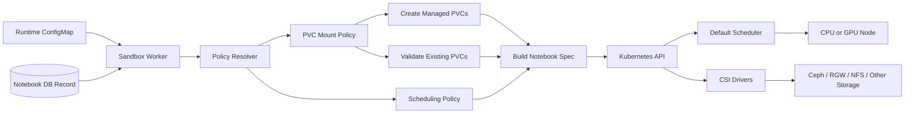
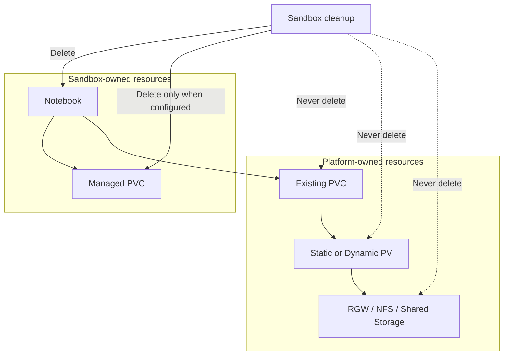
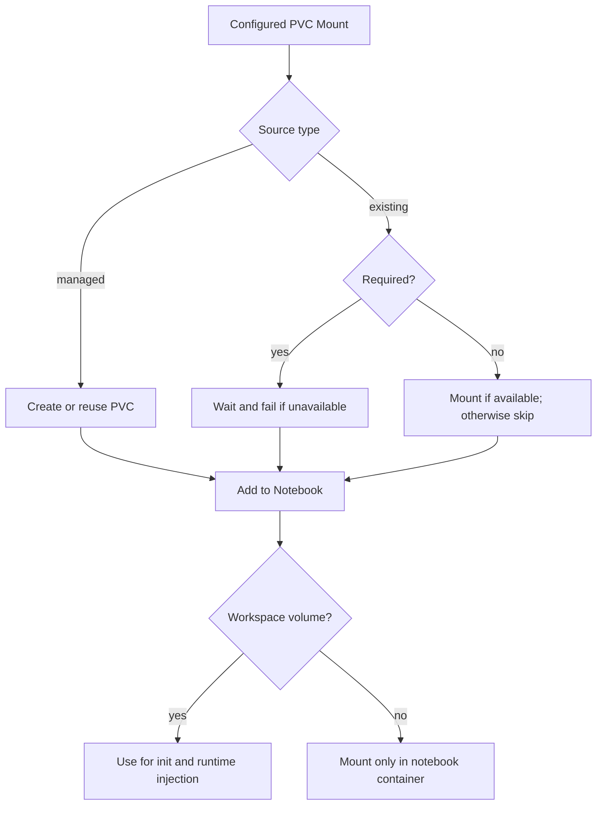
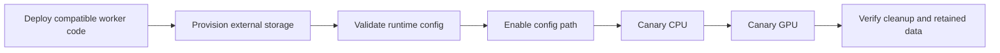

# Generic Scheduling and PVC-Mount Architecture

## Summary

Replace hard-coded CPU/GPU node selection and the single hard-coded PVC mount with a versioned runtime configuration.

Each project can define:

- CPU and/or GPU scheduling rules.
- Zero or more PVC mounts.
- Managed or existing PVCs.
- Required or optional mounts.
- One optional workspace volume for notebook initialization and runtime file injection.

Names such as `uploads`, `artifacts`, and `cbr` are deployment choices, not worker requirements.

## Architecture



Storage ownership:



## Configuration Interface

```yaml
apiVersion: sandbox-connect/v1alpha1

defaults:
  externalPVCWaitTimeout: 120s

workloads:
  cpu:
    scheduling:
      nodeSelector: {}
      affinity: {}
      tolerations: []
      instanceTypeOverride:
        enabled: false

    pvcMounts:
      - name: user-data
        mountPath: /home/jovyan
        workspace: true
        required: true
        readOnly: false
        source:
          type: managed
          claimNameTemplate: "{pvcName}"
          retentionPolicy: DeleteWithNotebook
          spec:
            storageClassName: rook-ceph
            accessModes: [ReadWriteOnce]
            resources:
              requests:
                storage: "{storageSize}"

      - name: shared-data
        mountPath: /mnt/shared
        required: false
        readOnly: true
        source:
          type: existing
          claimNameTemplate: shared-data
          waitForBound: true

  gpu:
    scheduling:
      nodeSelector:
        sandbox.tgdex.io/workload: gpu
      affinity: {}
      tolerations:
        - key: nvidia.com/gpu
          operator: Exists
          effect: NoSchedule
      instanceTypeOverride:
        enabled: true
        selectorKey: node.kubernetes.io/instance-type
        required: true

    pvcMounts: []
```

Configuration behavior:



Generic validation will enforce only:

- Known configuration version and fields.
- At least one workload policy.
- Valid Kubernetes selectors, affinity, and tolerations.
- Unique volume names and mount paths.
- Valid absolute mount paths and safe relative subpaths.
- Valid claim names after template rendering.
- Correct fields for `managed` versus `existing`.
- Valid retention policies and PVC specifications.
- At most one `workspace` mount per workload.
- Supported templates: `{namespace}`, `{notebookName}`, `{pvcName}`, and `{storageSize}`.

It will not require:

- Both CPU and GPU.
- A fixed number of PVCs.
- Uploads, artifacts, CBR, or user-data mounts.
- Fixed mount paths, access modes, StorageClasses, or storage technologies.

## Implementation Changes

1. **Runtime policy loading**

   - Add `WORKER_RUNTIME_CONFIG_PATH`.
   - Strictly parse and validate YAML/JSON at startup.
   - Use legacy environment behavior only when the path is unset.

2. **Scheduling**

   - Copy configured `nodeSelector`, `affinity`, and `tolerations` into Notebook and helper pod specs.
   - Apply stored instance type only when `instanceTypeOverride` is enabled.
   - Fail a notebook clearly when its workload policy is not configured.

3. **PVC resolution**

   - Process only configured mounts.
   - Create compatible managed claims.
   - Validate required existing claims.
   - Skip unavailable optional claims.
   - Add only successfully resolved volumes to the Notebook.

4. **Workspace behavior**

   - Use the configured workspace volume for demo initialization and runtime file/Git injection.
   - Skip workspace init when no workspace exists.
   - Reject runtime-asset requests when no workspace is configured.

5. **Cleanup**

   - Label worker-created PVCs with notebook, volume, and retention metadata.
   - Delete only managed claims configured with `DeleteWithNotebook`.
   - Preserve retained and external claims.
   - Keep legacy `pvc_name` deletion as a backward-compatible fallback.

## TGDex Deployment Profile

The current deployment will configure four mounts, but these remain optional from the worker's perspective:

```text
/home/jovyan   -> Managed Ceph user-data PVC
/mnt/uploads   -> Existing per-user RGW PVC
/mnt/artifacts -> Existing per-user RGW PVC
/mnt/cbr       -> Existing CBR NFS PVC
```

Platform automation provisions:

```text
sandbox-uploads   -> volumeHandle: uploads/{namespace}
sandbox-artifacts -> volumeHandle: no-code-artifacts/{namespace}
cbr-nfs           -> CBR-provided NFS storage
```

The worker validates and mounts these claims but never creates or deletes their PVs, PVCs, or backing data.

## Tests and Rollout

Test configurations with:

- CPU only, GPU only, and both.
- Zero, one, two, and four PVC mounts.
- Required and optional existing claims.
- Managed delete and retain policies.
- Missing workspace and runtime-asset requests.
- Instance-type override enabled and disabled.
- Partial provisioning failure and cleanup.
- Preservation of all external claims.

Roll out in this order:



Acceptance requires that only configured mounts appear, scheduling follows configuration, managed cleanup respects retention, external storage is preserved, and legacy deployments continue working when the new config is absent.
