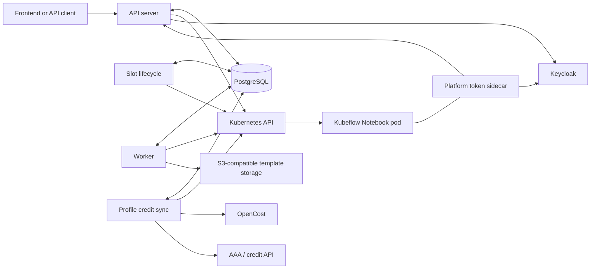
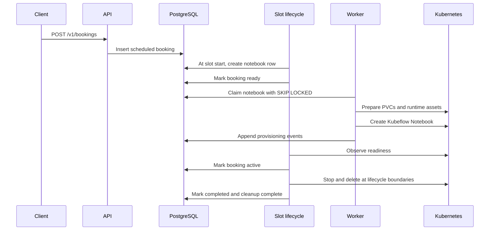

# Sandbox Connect architecture

Sandbox Connect is a Go service suite that provisions and manages Kubeflow notebooks, optionally
through scheduled bookings. PostgreSQL is the coordination store; Kubernetes is the runtime
source of truth for live notebook state.

## System context



Only the API is client-facing. The worker and slot lifecycle are long-running Deployments.
Profile credit sync is a CronJob. The platform token sidecar runs inside notebook pods rather than
as a standalone workload. JupyterLite static assets are bundled into and served by the API image.

## Components

| Component | Source | Responsibility |
|---|---|---|
| API server | `cmd/api` | Authentication, bookings/direct notebook APIs, profiles, live status, registry setup, JupyterLite, and delegated notebook token sessions |
| Worker | `cmd/worker` | Claims pending notebook rows, resolves the selected CPU/GPU template, prepares managed/existing PVCs, performs runtime injection, and creates the Kubeflow Notebook |
| Slot lifecycle | `cmd/cron/slot-lifecycle` | Advances booking state, creates notebook rows at slot start, starts/stops resources, and performs timed cleanup |
| Profile credit sync | `cmd/cron/profile-credit-sync` | Reconciles profiles and usage with OpenCost and the AAA/credit service |
| Platform token sidecar | `cmd/platform-token-sidecar` | Publishes a delegated access token inside a notebook, refreshes it, and persists refresh-token rotation through the API |
| Shared packages | `pkg` | PostgreSQL, Kubernetes, S3, GPU profile, constants, and common helpers |

See the [configuration index](config/README.md) for ownership of every runtime setting.

## Operating modes

`API_BOOKINGS_ENABLED` selects the public lifecycle model:

- **Booking mode:** clients create and manage reservations through `/v1/bookings` and query
  `/v1/slots` and `/v1/categories`. Slot lifecycle owns notebook start, stop, and cleanup timing.
- **Direct mode:** clients use `/v1/notebook/create`, `/start`, `/stop`, and `/delete`. Booking and
  slot routes are disabled.

Notebook list, status, profile creation, JupyterLite session, and token-session routes remain
available according to their route-specific checks. The generated [OpenAPI specification](swagger.yaml)
is the endpoint-level reference.

## Booking and notebook lifecycle



The principal booking path is:

```text
scheduled → ready → active → shutting_down → completed
```

Cancellation, expiration, reset, and early termination create alternate transitions. Cleanup
completion is recorded separately so a completed booking can be retried safely if Kubernetes
cleanup initially fails.

Notebook provisioning events are a different state stream. The worker appends events such as
`picked`, `pvc-applied`, runtime-injection results, and `notebook-applied` or a failure event. Do
not treat booking status and notebook events as interchangeable.

The API derives user-facing runtime state from both the latest database event and the live
Kubeflow Notebook:

- `opening`: provisioning is incomplete or the pod has no ready replica;
- `running`: the Notebook is applied and has a ready replica;
- `stopped`: the Kubeflow stopped annotation is present;
- `failed`: provisioning recorded a failure event; and
- `orphaned`: the database says applied but the Notebook resource is absent.

## Worker templates, scheduling, and storage

CPU and GPU are separate, strictly validated `SandboxNotebookTemplate` bundles mounted from
`infra/worker/configmap.yaml`. Each bundle contains:

1. a wrapper with `spec.lifecycle` and a complete embedded Kubeflow Notebook; and
2. optional following PVC documents for worker-managed volumes.

The embedded Notebook owns static pod configuration, including images, scheduling, security,
native volumes, init containers, and sidecars. The worker patches only request-specific identity,
resources, allowed template tokens, optional-volume removal, runtime injection, and platform-token
session values.

Storage ownership is explicit:

- **Managed PVC:** created by the worker from a bundled PVC document and deleted or retained
  according to its lifecycle policy.
- **Existing PVC:** created outside Sandbox Connect; the worker may wait for and validate it but
  never owns or deletes it.
- **Profile workspace PVC:** optionally created by the API and mounted by the worker when
  `WORKSPACE_ENABLED` agrees across both services.
- **Native Notebook volumes:** NFS, Secret, `emptyDir`, and other volumes remain entirely
  template-owned.

The current contract is maintained in the [worker template reference](../infra/worker/README.md)
and [worker configuration reference](config/worker.md).

## Delegated notebook token sessions

The API exchanges a browser access token for a notebook-client access/refresh-token pair. It
validates the delegated subject and authorized party, writes a per-notebook bootstrap Secret, and
waits for the sidecar to publish the access token before returning success.

The sidecar:

1. validates bootstrap/session identity;
2. writes the current access token to the shared in-pod cache;
3. refreshes through Keycloak before expiry; and
4. sends rotated refresh tokens back to the booking or direct-notebook API endpoint.

The notebook container receives the delegated access token, not the confidential client secret or
raw refresh token. The [canonical Keycloak setup](config/api.md#canonical-keycloak-setup) documents
the trust and audience requirements.

## Concurrency and consistency

- The API uses row locks to serialize conflicting profile/booking operations.
- The worker claims pending notebook rows with `FOR UPDATE SKIP LOCKED`, allowing multiple worker
  goroutines without double provisioning.
- Slot lifecycle processes bounded batches and uses conditional status updates so repeated ticks
  are idempotent.
- Kubernetes `AlreadyExists` and `NotFound` cases are handled as lifecycle outcomes rather than
  unconditional fatal errors.
- Worker failure cleanup removes resources it owns while preserving existing/external PVCs.

## Security boundaries

- Keycloak authenticates API callers; the API pins the configured realm signing key.
- Kubernetes RBAC is granted through `notebook-manager-sa`.
- User notebook containers run arbitrary code and must not receive the notebook client's secret.
- The token sidecar mounts client and refresh credentials from restricted files, while the access
  token is published through a separate shared volume.
- Worker templates enforce core container hardening, but admission policy and network policy remain
  cluster responsibilities.
- Registry, database, S3, Keycloak, RabbitMQ, and AAA credentials belong in Kubernetes Secrets,
  never ConfigMaps or committed files.

## External dependencies

| Dependency | Used by |
|---|---|
| PostgreSQL | API, worker, slot lifecycle, profile credit sync |
| Kubernetes and Kubeflow Notebook/Profile CRDs | API, worker, slot lifecycle, profile credit sync |
| Keycloak | API, platform token sidecar, profile credit sync |
| S3-compatible storage | Worker runtime/template operations |
| OpenCost and AAA/credit API | Profile credit sync |
| Container registry | All deployable images and notebook images |
| RabbitMQ | Optional API audit publishing |

Deployment topology and verification are documented in [operations.md](operations.md).
