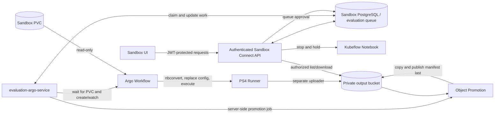
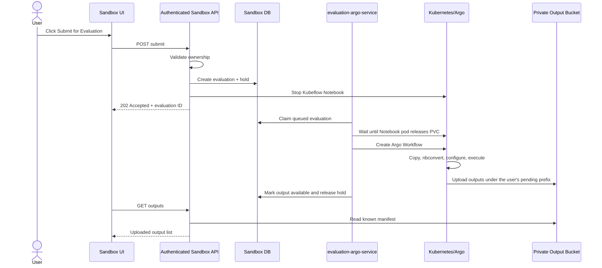
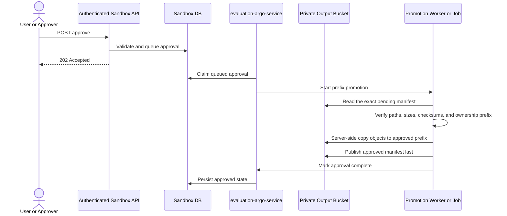

# `evaluation-argo-service` architecture

Status: focused discussion draft

## Scope

The new service is named **`evaluation-argo-service`**. It handles the new template, temporarily
called **PS4**. PS1, PS2, and PS3 belong only to the reference project.

Sandbox Connect exposes the authenticated Submit, List Outputs, and Approve APIs using its existing
JWT, ownership, notebook lifecycle, and file-service integrations. The `evaluation-argo-service` is
an internal worker/controller with no user-facing HTTP API. It does not score submissions and does
not contain an agentic or LLM loop. Together they:

1. accept Submit for Evaluation through Sandbox Connect;
2. stop the user's notebook and wait for its PVC to be released;
3. run an Argo Workflow that copies and converts the user's code;
4. replace approved sandbox environment values/URLs with production values;
5. execute the converted code;
6. upload the generated outputs into a private object-storage bucket through a platform-controlled
   uploader;
7. list those outputs through Sandbox Connect; and
8. after approval, promote the verified objects from an evaluation-specific pending prefix to an
   approved prefix in the same bucket.

The demo design does not require a common RWX filesystem. Outputs remain objects and are downloaded
through an authenticated platform endpoint or short-lived signed URL. Making approved outputs
appear as normal files inside every notebook is intentionally deferred until an RWX filesystem or a
separate explicit import/download feature is available.

No score or scorer is required in this service. If another system later scores the uploaded output,
that integration is outside this task.

The temporary PS4 notebook name is:

```text
nha_ps4_evaluation_template.ipynb
```

## High-level architecture



Sandbox Connect owns the authenticated user-facing APIs and durable evaluation/approval records.
The `evaluation-argo-service` owns only background Argo and object-promotion orchestration; it does not
expose user-facing routes or duplicate Sandbox authentication and ownership logic.

## Components

### 1. Sandbox UI

Add a **Submit for Evaluation** button beside the existing Start, Stop, and other notebook actions.

The UI:

- calls the submit endpoint;
- shows that the notebook is being stopped/evaluated;
- uses the output-list endpoint to show when results are available; and
- displays the Approve action when output upload is complete.

### 2. Sandbox Connect API

Sandbox Connect provides the three requested operations:

- submit and trigger evaluation;
- list generated outputs; and
- approve/promote generated outputs.

Because stopping a notebook and running a Workflow can take several minutes, submission must be
asynchronous. Sandbox Connect creates a durable evaluation record, applies the evaluation hold,
stops the Notebook, and returns an evaluation ID immediately.

It reuses the existing JWT, ownership, notebook/PVC, booking, and token-exchange logic. Start,
Delete, Reset, Terminate, and timed booking cleanup must respect the evaluation hold.

### 3. `evaluation-argo-service`

This is an internal background worker/controller. It:

- claims queued evaluations from the Sandbox evaluation table;
- waits until no running pod references the source PVC;
- creates and watches the Argo Workflow;
- records phases, failures, Workflow identity, and output-manifest location;
- claims approved requests and creates or performs the object-prefix promotion operation; and
- resumes unfinished work after restart.

For the simplest implementation, both processes use the same evaluation/approval tables in Sandbox
PostgreSQL. The worker receives a dedicated database role restricted to those tables and claims work
with `FOR UPDATE SKIP LOCKED`. It does not access unrelated Sandbox tables or expose an HTTP API.

### 4. Argo Workflow

The Workflow is new and deterministic. It has no sample-repair, agent, freeze, report, or scoring
stages.

```text
prepare -> nbconvert -> configure -> execute -> upload
```

### 5. Private object storage

For the demo, use one private output bucket and divide it by a stable platform-controlled user key,
sandbox, and evaluation ID. The bucket is an object store, not a mounted POSIX filesystem.

The preferred integration is the existing authenticated file-service API when it can enforce the
required bucket and prefix. If that API is not available for the demo, use a separate uploader and
promotion component with short-lived, prefix-limited credentials or workload identity. The
participant code must never receive bucket or file-service credentials.

The bucket must already exist or be provisioned separately. The evaluation service receives only
its configured name, region, and base prefix; it must not create, delete, or reconfigure production
buckets.

### 6. Demo access model

Approved results remain in object storage. Sandbox Connect lists only the manifest recorded for an
evaluation and returns authenticated downloads or short-lived signed URLs after verifying user
ownership. A bucket prefix is only an organizational boundary; authorization must be enforced by
Sandbox Connect, the file service, and IAM.

Do not mount the bucket into notebooks with S3 CSI for this demo. Object storage does not provide
the filesystem semantics expected from a shared workspace. If notebook-side access is needed, add
an explicit authenticated download/import operation that writes into a selected sandbox PVC after
performing the same path, size, and checksum validation.

## Submission sequence



## Notebook stop and PVC detach

The current Sandbox stop operation adds the Kubeflow stopped annotation, but that does not guarantee
the Notebook pod and EBS attachment are already gone. Sandbox Connect queues the evaluation after
stopping; the `evaluation-argo-service` must wait before creating the Workflow.

Required sequence:

```text
evaluation hold acquired
  -> Notebook stopped
  -> Notebook pod terminated
  -> no live pod references the sandbox PVC
  -> Argo Workflow created
  -> CSI attaches the PVC to the Workflow pod
```

The sandbox PVC is `ReadWriteOnce` in the inspected EKS environment. The Workflow mounts it
read-only, but the Notebook pod must still release it first because it cannot be attached to two
nodes at once.

Use bounded timeouts for pod termination and CSI detach/attach. On timeout, mark the evaluation as
failed, release the hold safely, and leave the Notebook stopped for the user to inspect/restart.

## Workflow details

### Step 1: Prepare

- Mount the sandbox PVC read-only at `/mnt/participant`.
- Create a per-run scratch workspace.
- Find the temporary fixed notebook `nha_ps4_evaluation_template.ipynb` at the configured relative
  path.
- Copy the notebook and its allowed supporting files to scratch.
- Reject paths or symlinks that escape the allowed source directory.
- Record a checksum of the staged input.

The original PVC is never changed.

### Step 2: Convert with nbconvert

Run a pinned version of `jupyter nbconvert` on the staged notebook:

```text
jupyter nbconvert --to script nha_ps4_evaluation_template.ipynb
```

Store the generated script and bounded conversion logs in scratch. If conversion fails, stop the
Workflow and return a safe conversion error.

### Step 3: Apply production configuration

Production values will be supplied later. Prefer passing them as runtime environment variables.

If values are hard-coded in the generated script and replacement is required:

- replace only exact, approved sandbox placeholders/URLs;
- apply changes only to the staged generated script;
- keep the replacement map in a versioned ConfigMap/Secret owned by the platform;
- fail if a required placeholder is unresolved;
- never place credentials into source files; and
- record the mapping version, not its secret values.

Do not perform broad search-and-replace across the full PVC.

### Step 4: Execute

- Execute the converted PS4 script using a pinned runner image.
- Supply the approved production environment.
- Write all generated output below `/workspace/output`.
- Capture bounded stdout and stderr logs.
- Apply CPU, memory, storage, and execution time limits.
- Run as non-root and allow network access only to required production services.

There is no automatic source repair and no scoring step.

### Step 5: Upload

Use a separate uploader step so the user's code never receives object-storage or file-service
credentials.

Suggested bucket key layout:

```text
<base-prefix>/users/<opaque-user-key>/sandboxes/<sandbox-name>/evaluations/<evaluation-id>/
  pending/
    output/
    execution-summary.json
    manifest.json
  approved/
    output/
    execution-summary.json
    manifest.json
```

The user key must come from trusted authenticated identity data and should be an opaque stable ID or
one-way derived identifier rather than an email address or other personal information. It must
never be accepted from the request body.

The manifest records each relative path, object key, size, media type, and SHA-256 checksum. Upload
the pending manifest last. Its presence means the pending output set is complete; partial uploads
are not listed or approved.

On approval, copy objects server-side from `pending/` to `approved/`, verify the copied object
metadata/checksums, and write the approved manifest last. S3-style object stores do not provide an
atomic directory rename, so the approved manifest is the only publication marker. APIs must never
expose objects merely because they exist below `approved/`.

## API proposal

These are the only product operations required for this task, and all three are authenticated
Sandbox Connect routes. The `evaluation-argo-service` has no user-facing routes.

They are exposed through the platform ingress but are never anonymous. Each request passes through
the existing Sandbox JWT middleware. Submit checks notebook ownership, List Outputs checks
evaluation ownership, and Approve checks evaluation ownership plus the configured approver policy.
Missing or invalid authentication returns `401`; insufficient ownership/role returns `403` or a
non-disclosing `404`, following existing Sandbox conventions.

### 1. Submit

```http
POST /v1/notebooks/{notebook_name}/evaluations
Idempotency-Key: <unique value>
```

The body can be empty. Sandbox Connect resolves the user, namespace, PVC, notebook path, and output
prefix from its trusted data/configuration.

```json
{
  "evaluationId": "018f...",
  "notebookName": "ps4-sandbox",
  "status": "stopping"
}
```

Return `202 Accepted`. Only one active evaluation is allowed per sandbox. Repeating the same
idempotency key returns the existing evaluation instead of starting another Workflow.

### 2. List outputs

```http
GET /v1/evaluations/{evaluation_id}/outputs
```

This endpoint verifies ownership and reads only the exact manifest key recorded for the evaluation.

- While processing: return the current phase with no outputs.
- After success: return the generated file list and metadata.
- After failure: return a safe failure code/message.

It is not a general-purpose S3 browser.

### 3. Approve outputs

```http
POST /v1/evaluations/{evaluation_id}/approve
Idempotency-Key: <unique value>
```

This creates an asynchronous server-side object promotion. The API request itself does not
download/copy large files.

## Approval and object promotion flow



Suggested approved prefix:

```text
<base-prefix>/users/<opaque-user-key>/sandboxes/<sandbox-name>/evaluations/<evaluation-id>/approved/
```

Repeated approval is safe: if the same verified approved manifest already exists, return the
existing success. Never overwrite a different manifest or object version. If promotion fails before
the approved manifest is written, the incomplete objects remain invisible to the API and can be
removed later by a bounded cleanup process.

## Minimal state

Sandbox Connect adds only enough durable state for the internal worker to resume asynchronous work:

```text
evaluations
  evaluation_id
  user_id
  notebook_name
  namespace
  source_pvc
  status
  workflow_name and workflow_uid
  output_prefix and manifest_key
  idempotency_key
  safe_error
  timestamps

approvals
  evaluation_id
  requested_by
  status
  promotion_job_name
  approved_prefix and approved_manifest_key
  idempotency_key
  safe_error
  timestamps
```

Suggested evaluation phases:

```text
requested -> stopping -> waiting_for_pvc -> preparing -> converting
          -> configuring -> executing -> uploading -> succeeded

any non-terminal phase -> failed
```

Approval phases are `requested -> promoting -> approved`, with a retryable `failed` state.

## Security and reliability requirements

- Reuse Sandbox Connect's existing JWT validation and sandbox/evaluation ownership checks on every
  authenticated user-facing API.
- Give `evaluation-argo-service` a dedicated database role limited to the evaluation and approval
  queue tables.
- Never accept namespace, PVC, command, runner image, replacement map, or output prefix from the
  browser.
- Mount the user's PVC read-only.
- Pin runner and uploader images by digest.
- Run as non-root with no privilege escalation, dropped capabilities, resource limits, and an
  active deadline.
- Give the execution step only required production egress.
- Keep the bucket private, enable encryption at rest, block public access, and configure bounded
  lifecycle retention for abandoned pending data.
- Give the uploader a short-lived credential or workload identity limited to the exact pending
  evaluation prefix. If shared credentials are unavoidable for the demo, isolate them to the
  uploader container, restrict them to the configured bucket/base prefix, and rotate them after the
  demo.
- Give the promotion component read access only to the exact pending prefix and write access only to
  the matching approved prefix. It must not accept arbitrary source or destination keys.
- Do not expose the uploader credential to the executed code.
- Never use the bucket prefix alone as authorization. Check the authenticated owner before listing,
  signing, downloading, or approving any object.
- Prefer bucket versioning or conditional writes so a retry cannot silently replace previously
  approved data.
- Add Workflow TTL, pod/scratch-volume cleanup, concurrency limits, and restart reconciliation.
- Do not log tokens, secret environment values, notebook source, or generated output content.

## What may be reused from the reference project

PS1, PS2, and PS3 functionality is not part of this service. Only generic implementation ideas may
be adapted:

| Reference area | Possible reuse |
|---|---|
| `internal/argo/workflow.go` and `templates.go` | Typed Argo Workflow construction and testing patterns |
| `runner/stages/prepare.py` | Read-only PVC copy, ignored files, source checksums, and unsafe symlink handling |
| `runner/core/credentials.py` | Deterministic environment replacement ideas, only if they match the supplied PS4 mapping |
| Workflow and runner tests | Mount, stage ordering, failure, and isolation test patterns |

Do not reuse the agent loop, LLM code, scorers, PS1/PS2/PS3 data profiles, report generation, rerun
system, reference API/UI/database, or direct S3 archive implementation.

## Demo bucket configuration and limitations

Required configuration:

1. existing private bucket name and region;
2. fixed base prefix dedicated to evaluation output;
3. uploader and promotion identity/credential mechanism;
4. encryption, public-access block, retention, and cleanup policy;
5. maximum object count, individual object size, and total evaluation size;
6. signed-download lifetime or file-service download contract; and
7. an opaque user-key derivation that is stable and collision resistant.

This is feasible for the demo and is usually simpler than introducing RWX storage. It also fits the
write-once evaluation-output model well. It is not a transparent replacement for a common
workspace: applications cannot safely use object keys as normal files, approval is a manifest-based
publication rather than an atomic directory rename, and notebook code needs a download/import flow
to consume approved outputs locally.

The existing optional evaluation-workspace configuration should remain disabled in the target
environment. It can be retained as a future delivery backend, but the bucket backend and workspace
backend must be selected explicitly by configuration; the service must not silently fall back from
one to the other.
