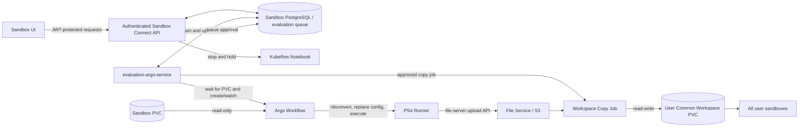
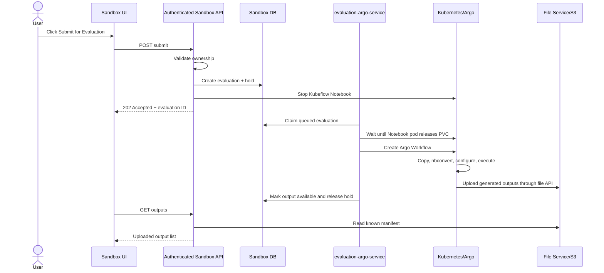
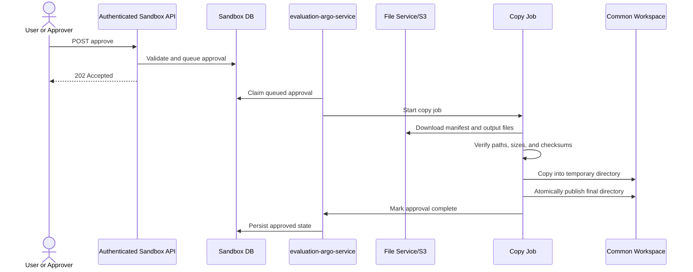

# `evaluation-argo-service` architecture

Status: focused discussion draft

## Scope

The new service is named **`evaluation-argo-service`**. It handles the new template, temporarily
called **PS4**. PS1, PS2, and PS3 belong only to the reference project.

Sandbox Connect exposes the authenticated Submit, List Outputs, and Approve APIs using its existing
JWT, ownership, notebook lifecycle, and file-service integrations. The `evaluation-argo-service` is
an internal worker/controller with no user-facing HTTP API. It does not score submissions and does
not contain an agentic or LLM loop. Together they:

1. accept Submit for Evaluation through Sandbox Connect;
2. stop the user's notebook and wait for its PVC to be released;
3. run an Argo Workflow that copies and converts the user's code;
4. replace approved sandbox environment values/URLs with production values;
5. execute the converted code;
6. upload the generated outputs through the file-server API;
7. list those outputs through Sandbox Connect; and
8. after approval, copy the outputs from the file service/S3 into the user's common workspace.

No score or scorer is required in this service. If another system later scores the uploaded output,
that integration is outside this task.

The temporary PS4 notebook name is:

```text
nha_ps4_evaluation_template.ipynb
```

## High-level architecture



Sandbox Connect owns the authenticated user-facing APIs and durable evaluation/approval records.
The `evaluation-argo-service` owns only background Argo and copy-job orchestration; it does not
expose user-facing routes or duplicate Sandbox authentication and ownership logic.

## Components

### 1. Sandbox UI

Add a **Submit for Evaluation** button beside the existing Start, Stop, and other notebook actions.

The UI:

- calls the submit endpoint;
- shows that the notebook is being stopped/evaluated;
- uses the output-list endpoint to show when results are available; and
- displays the Approve action when output upload is complete.

### 2. Sandbox Connect API

Sandbox Connect provides the three requested operations:

- submit and trigger evaluation;
- list generated outputs; and
- approve/copy generated outputs.

Because stopping a notebook and running a Workflow can take several minutes, submission must be
asynchronous. Sandbox Connect creates a durable evaluation record, applies the evaluation hold,
stops the Notebook, and returns an evaluation ID immediately.

It reuses the existing JWT, ownership, notebook/PVC, booking, token-exchange, and common-workspace
logic. Start, Delete, Reset, Terminate, and timed booking cleanup must respect the evaluation hold.

### 3. `evaluation-argo-service`

This is an internal background worker/controller. It:

- claims queued evaluations from the Sandbox evaluation table;
- waits until no running pod references the source PVC;
- creates and watches the Argo Workflow;
- records phases, failures, Workflow identity, and output-manifest location;
- claims approved copy requests and creates the workspace copy job; and
- resumes unfinished work after restart.

For the simplest implementation, both processes use the same evaluation/approval tables in Sandbox
PostgreSQL. The worker receives a dedicated database role restricted to those tables and claims work
with `FOR UPDATE SKIP LOCKED`. It does not access unrelated Sandbox tables or expose an HTTP API.

### 4. Argo Workflow

The Workflow is new and deterministic. It has no sample-repair, agent, freeze, report, or scoring
stages.

```text
prepare -> nbconvert -> configure -> execute -> upload
```

### 5. File service/S3

All generated files are uploaded through the existing file-server upload endpoint. The runner does
not upload directly to S3.

### 6. Common user workspace

Create or enable one profile/user-scoped RWX workspace PVC. Attach that same workspace to all of the
user's sandboxes at a stable mount path such as:

```text
/home/jovyan/workspace
```

The approval copy job mounts it read-write. Whether normal sandbox containers mount it read-only or
read-write is a product decision; read-only is safer for preserving approved results.

## Submission sequence



## Notebook stop and PVC detach

The current Sandbox stop operation adds the Kubeflow stopped annotation, but that does not guarantee
the Notebook pod and EBS attachment are already gone. Sandbox Connect queues the evaluation after
stopping; the `evaluation-argo-service` must wait before creating the Workflow.

Required sequence:

```text
evaluation hold acquired
  -> Notebook stopped
  -> Notebook pod terminated
  -> no live pod references the sandbox PVC
  -> Argo Workflow created
  -> CSI attaches the PVC to the Workflow pod
```

The sandbox PVC is `ReadWriteOnce` in the inspected EKS environment. The Workflow mounts it
read-only, but the Notebook pod must still release it first because it cannot be attached to two
nodes at once.

Use bounded timeouts for pod termination and CSI detach/attach. On timeout, mark the evaluation as
failed, release the hold safely, and leave the Notebook stopped for the user to inspect/restart.

## Workflow details

### Step 1: Prepare

- Mount the sandbox PVC read-only at `/mnt/participant`.
- Create a per-run scratch workspace.
- Find the temporary fixed notebook `nha_ps4_evaluation_template.ipynb` at the configured relative
  path.
- Copy the notebook and its allowed supporting files to scratch.
- Reject paths or symlinks that escape the allowed source directory.
- Record a checksum of the staged input.

The original PVC is never changed.

### Step 2: Convert with nbconvert

Run a pinned version of `jupyter nbconvert` on the staged notebook:

```text
jupyter nbconvert --to script nha_ps4_evaluation_template.ipynb
```

Store the generated script and bounded conversion logs in scratch. If conversion fails, stop the
Workflow and return a safe conversion error.

### Step 3: Apply production configuration

Production values will be supplied later. Prefer passing them as runtime environment variables.

If values are hard-coded in the generated script and replacement is required:

- replace only exact, approved sandbox placeholders/URLs;
- apply changes only to the staged generated script;
- keep the replacement map in a versioned ConfigMap/Secret owned by the platform;
- fail if a required placeholder is unresolved;
- never place credentials into source files; and
- record the mapping version, not its secret values.

Do not perform broad search-and-replace across the full PVC.

### Step 4: Execute

- Execute the converted PS4 script using a pinned runner image.
- Supply the approved production environment.
- Write all generated output below `/workspace/output`.
- Capture bounded stdout and stderr logs.
- Apply CPU, memory, storage, and execution time limits.
- Run as non-root and allow network access only to required production services.

There is no automatic source repair and no scoring step.

### Step 5: Upload

Use a separate uploader step so the user's code never receives file-service credentials.

Suggested file-service prefix:

```text
/user/<sandbox-name>/evaluations/<evaluation-id>/
  output/
  execution-summary.json
  manifest.json
```

The manifest records each relative path, size, media type, and SHA-256 checksum. Upload it last. Its
presence means the output set is complete; partial uploads are not listed or approved.

The final prefix must match the file server's exact `/user/...` path contract once that contract is
shared.

## API proposal

These are the only product operations required for this task, and all three are authenticated
Sandbox Connect routes. The `evaluation-argo-service` has no user-facing routes.

They are exposed through the platform ingress but are never anonymous. Each request passes through
the existing Sandbox JWT middleware. Submit checks notebook ownership, List Outputs checks
evaluation ownership, and Approve checks evaluation ownership plus the configured approver policy.
Missing or invalid authentication returns `401`; insufficient ownership/role returns `403` or a
non-disclosing `404`, following existing Sandbox conventions.

### 1. Submit

```http
POST /v1/notebooks/{notebook_name}/evaluations
Idempotency-Key: <unique value>
```

The body can be empty. Sandbox Connect resolves the user, namespace, PVC, notebook path, and output
prefix from its trusted data/configuration.

```json
{
  "evaluationId": "018f...",
  "notebookName": "ps4-sandbox",
  "status": "stopping"
}
```

Return `202 Accepted`. Only one active evaluation is allowed per sandbox. Repeating the same
idempotency key returns the existing evaluation instead of starting another Workflow.

### 2. List outputs

```http
GET /v1/evaluations/{evaluation_id}/outputs
```

This endpoint verifies ownership and reads only the known `manifest.json` for the evaluation.

- While processing: return the current phase with no outputs.
- After success: return the generated file list and metadata.
- After failure: return a safe failure code/message.

It is not a general-purpose S3 browser.

### 3. Approve outputs

```http
POST /v1/evaluations/{evaluation_id}/approve
Idempotency-Key: <unique value>
```

This creates an asynchronous copy job. The API request itself does not download/copy large files.

## Approval and copy flow



Suggested destination:

```text
/home/jovyan/workspace/evaluations/<sandbox-name>/<evaluation-id>/
```

The job first writes to `.incoming/<evaluation-id>` and only exposes the final directory after all
checks pass. Repeated approval is safe: if the same verified manifest already exists, return the
existing success; never overwrite different data.

## Minimal state

Sandbox Connect adds only enough durable state for the internal worker to resume asynchronous work:

```text
evaluations
  evaluation_id
  user_id
  notebook_name
  namespace
  source_pvc
  status
  workflow_name and workflow_uid
  output_prefix and manifest_key
  idempotency_key
  safe_error
  timestamps

approvals
  evaluation_id
  requested_by
  status
  copy_job_name
  destination
  idempotency_key
  safe_error
  timestamps
```

Suggested evaluation phases:

```text
requested -> stopping -> waiting_for_pvc -> preparing -> converting
          -> configuring -> executing -> uploading -> succeeded

any non-terminal phase -> failed
```

Approval phases are `requested -> copying -> approved`, with a retryable `failed` state.

## Security and reliability requirements

- Reuse Sandbox Connect's existing JWT validation and sandbox/evaluation ownership checks on every
  authenticated user-facing API.
- Give `evaluation-argo-service` a dedicated database role limited to the evaluation and approval
  queue tables.
- Never accept namespace, PVC, command, runner image, replacement map, or output prefix from the
  browser.
- Mount the user's PVC read-only.
- Pin runner and uploader images by digest.
- Run as non-root with no privilege escalation, dropped capabilities, resource limits, and an
  active deadline.
- Give the execution step only required production egress.
- Give the uploader a run-scoped file-service credential limited to the evaluation prefix where
  possible.
- Do not expose the uploader credential to the executed code.
- Add Workflow TTL, pod/scratch-volume cleanup, concurrency limits, and restart reconciliation.
- Do not log tokens, secret environment values, notebook source, or generated output content.

## What may be reused from the reference project

PS1, PS2, and PS3 functionality is not part of this service. Only generic implementation ideas may
be adapted:

| Reference area | Possible reuse |
|---|---|
| `internal/argo/workflow.go` and `templates.go` | Typed Argo Workflow construction and testing patterns |
| `runner/stages/prepare.py` | Read-only PVC copy, ignored files, source checksums, and unsafe symlink handling |
| `runner/core/credentials.py` | Deterministic environment replacement ideas, only if they match the supplied PS4 mapping |
| Workflow and runner tests | Mount, stage ordering, failure, and isolation test patterns |

Do not reuse the agent loop, LLM code, scorers, PS1/PS2/PS3 data profiles, report generation, rerun
system, reference API/UI/database, or direct S3 archive implementation.

## Common workspace changes

The development Sandbox Connect checkout already contains the beginnings of a shared workspace:

- profile-scoped PVC named `workspace`;
- RWX access with `ceph-filesystem` currently hard-coded; and
- mount at `/home/jovyan/workspace` in notebook templates.

For the target environment:

1. make workspace claim name, storage class, size, access mode, and mount path configurable;
2. provision an RWX filesystem class, preferably EFS CSI on EKS;
3. enable the workspace in both API and worker notebook templates;
4. create/reconcile it for existing users; and
5. ensure every sandbox belonging to the user mounts the same user-scoped claim.

S3 CSI is not assumed to behave as a POSIX common workspace without explicit testing.

## Current deployment prerequisites

The apparent live configuration at `/home/dev-user/sandbox-connect-api/infra` belongs to a separate
`slot-booking` checkout, not the same revision as the development repository.

On the currently selected `dev-eks-cluster`, inspection showed:

- Argo Workflows CRDs are not installed;
- sandbox PVCs use EBS `ReadWriteOnce`;
- shared workspace is not enabled in the deployed configuration; and
- no RWX filesystem storage class is available.

The target environment therefore requires Argo, the `evaluation-argo-service` worker/controller,
evaluation RBAC and NetworkPolicies, and an RWX workspace storage class before end-to-end
deployment. No user-facing Kubernetes Service or ingress is required for the worker.

## Details still needed

1. Final path/name of the PS4 notebook and which supporting files must be copied from the PVC.
2. Exact environment variable names and sandbox-to-production URL values.
3. File-server upload/list/download endpoints, authentication, limits, and exact `/user/...` path.
4. Who is allowed to approve: the user, an admin/reviewer, or both.
5. Whether common workspace mounts inside normal sandboxes should be read-only or read-write.
6. The target cluster/environment and booking behavior after Submit for Evaluation.
