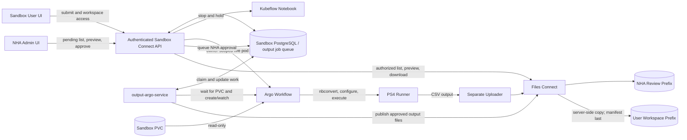
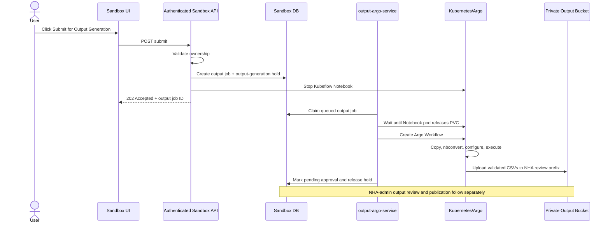
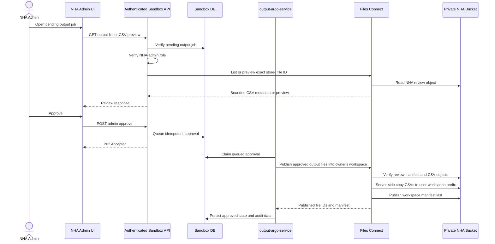

# `output-argo-service` architecture

Status: focused discussion draft

## Scope

The new service is named **`output-argo-service`**. It handles the new template, temporarily
called **PS4**. PS1, PS2, and PS3 belong only to the reference project.

In this document, an **output job** is the durable asynchronous submission record, while an
**output** is a generated CSV file or its approved workspace entry.

Sandbox Connect exposes authenticated submission, NHA-admin review/approval, and user-workspace
APIs using its existing JWT, ownership, notebook lifecycle, and Files Connect integrations. The
`output-argo-service` is an internal worker/controller with no user-facing HTTP API. It does not
score submissions and does not contain an agentic or LLM loop. Together they:

1. accept Submit for Output Generation through Sandbox Connect;
2. stop the user's notebook and wait for its PVC to be released;
3. run an Argo Workflow that copies and converts the user's code;
4. replace approved sandbox environment values/URLs with production values;
5. execute the converted code;
6. validate that the user-generated deliverables are CSV files and upload them to an NHA review
   area in the configured private bucket;
7. show NHA admins the durable pending-approval queue and bounded CSV previews;
8. after NHA-admin approval, publish the verified CSV files into the user's object-backed workspace;
   and
9. let the user list, preview, and download only approved workspace files.

The demo design does not require a common RWX filesystem. The user workspace is a logical,
user-scoped Files Connect view over approved objects. It is not mounted into notebooks as a POSIX
filesystem.

No score or scorer is required in this service. If another system later scores the uploaded output,
that integration is outside this task.

The temporary PS4 notebook name is:

```text
nha_ps4_output_template.ipynb
```

## High-level architecture



Sandbox Connect owns the authenticated user-facing APIs, NHA-admin authorization, and durable
output-job and approval records. The `output-argo-service` owns only background Argo and approved
workspace-publication orchestration; it does not expose user-facing routes or duplicate Sandbox
authentication and ownership logic.

## Components

### 1. Sandbox and NHA admin UI

Add a **Submit for Output Generation** button beside the existing Start, Stop, and other notebook actions.

The user-facing UI:

- calls the submit endpoint;
- shows that the notebook is being stopped and output generation is running;
- polls the owned output status for the timeline and uses the authenticated SSE endpoint while the
  modal is open to display live logs from the five Workflow stages; and
- provides an object-backed workspace where the user can list, preview, and download approved CSV
  files.

The NHA-admin UI:

- lists output jobs in the durable `pending_approval` state;
- lists only the files in the exact manifest recorded for an output job;
- renders a bounded CSV preview; and
- provides the Approve action.

### 2. Sandbox Connect API

Sandbox Connect provides separate user and NHA-admin operations:

- submit an owned notebook and view its output job status;
- list, preview, and download the authenticated user's approved workspace files;
- list output jobs pending NHA approval;
- list and preview a pending output job's CSV output; and
- approve publication into the owning user's workspace.

Because stopping a notebook and running a Workflow can take several minutes, submission must be
asynchronous. Sandbox Connect creates a durable output job record, applies the output-generation hold,
stops the Notebook, and returns an output job ID immediately.

It reuses the existing JWT, ownership, notebook/PVC, booking, and token-exchange logic. Start,
Delete, Reset, Terminate, and timed booking cleanup must respect the output-generation hold.

### 3. `output-argo-service`

This is an internal background worker/controller. It:

- claims queued output jobs from the Sandbox output-jobs table;
- waits until no running pod references the source PVC;
- creates and watches the Argo Workflow;
- records phases, failures, Workflow identity, and output-manifest location;
- claims NHA-approved requests and asks Files Connect to publish them into the owning user's
  object-backed workspace; and
- resumes unfinished work after restart.

For the simplest implementation, both processes use the same output-job and approval tables in Sandbox
PostgreSQL. The worker receives a dedicated database role restricted to those tables and claims work
with `FOR UPDATE SKIP LOCKED`. It does not access unrelated Sandbox tables or expose an HTTP API.

### 4. Argo Workflow

The Workflow is new and deterministic. It has no sample-repair, agent, freeze, report, or scoring
stages.

```text
prepare -> nbconvert -> configure -> execute -> upload
```

### 5. Private object storage

For the demo, use one configured private NHA output bucket with two logical areas:

```text
<base-prefix>/
  nha-review/users/<opaque-user-key>/sandboxes/<sandbox-name>/outputs/<output-id>/
  user-workspaces/users/<opaque-user-key>/outputs/<output-id>/
```

The NHA review area contains successfully generated CSV files awaiting approval. The user-workspace
area contains only CSV files that an NHA admin approved. The bucket is an object store, not a mounted
POSIX filesystem.

The bucket must already exist or be provisioned separately. The output service and Files
Connect receive only its configured name, region, and base prefix; they must not create, delete, or
reconfigure production buckets.

### 6. Files Connect

The current Files Connect API is a reusable baseline, not a fixed contract. Its existing databank
operations can provide:

- `POST /databanks/{databankId}/files` for bounded file listing;
- `POST /databanks/{databankId}/files/preview` for CSV preview;
- `POST /databanks/{databankId}/files/download` for content or a short-lived download URL; and
- the multipart upload initiation/completion operations.

Output-specific extensions are still required. Proposed internal Files Connect operations are:

```text
POST /v1/outputs/{output_id}/uploads
POST /v1/outputs/{output_id}/complete
POST /v1/outputs/{output_id}/publish
```

The upload operation derives the NHA review key from trusted output-job data and rejects
non-CSV deliverables. `complete` independently validates and records the exact CSV manifest.
`publish` performs an idempotent server-side copy into the owning user's workspace and writes
the workspace manifest last.

Sandbox Connect may reuse the existing list, preview, and download primitives, but browsers must
not provide arbitrary databank IDs, prefixes, or object keys. Sandbox Connect resolves exact stored
file IDs and keys after checking either NHA-admin authorization or user ownership. The current
public metadata operation must not be used for pending or approved output files unless it is
protected by authentication and authorization.

### 7. Demo access model

The NHA admin sees the pending queue from Sandbox PostgreSQL, which remains the source of truth for
workflow and approval state. For each selected output job, Sandbox Connect asks Files Connect for
only the exact manifest and CSV files recorded for that output job; it does not discover pending
work by browsing the bucket.

The user's workspace is a logical Files Connect view over the user's approved prefix. Sandbox
Connect returns bounded previews, authenticated downloads, or short-lived signed URLs after
verifying ownership. Do not mount the bucket into notebooks with S3 CSI for this demo.

## Submission sequence



## Notebook stop and PVC detach

The current Sandbox stop operation adds the Kubeflow stopped annotation, but that does not guarantee
the Notebook pod and EBS attachment are already gone. Sandbox Connect queues the output job after
stopping; the `output-argo-service` must wait before creating the Workflow.

Required sequence:

```text
output-generation hold acquired
  -> Notebook stopped
  -> Notebook pod terminated
  -> no live pod references the sandbox PVC
  -> Argo Workflow created
  -> CSI attaches the PVC to the Workflow pod
```

The sandbox PVC is `ReadWriteOnce` in the inspected EKS environment. The Workflow mounts it
read-only, but the Notebook pod must still release it first because it cannot be attached to two
nodes at once.

Use bounded timeouts for pod termination and CSI detach/attach. On timeout, mark the output job as
failed, release the hold safely, and leave the Notebook stopped for the user to inspect/restart.

## Workflow details

### Step 1: Prepare

- Mount the sandbox PVC read-only at `/mnt/participant`.
- Create a per-run scratch workspace.
- Find the temporary fixed notebook `nha_ps4_output_template.ipynb` at the configured relative
  path.
- Copy the notebook and its allowed supporting files to scratch.
- Reject paths or symlinks that escape the allowed source directory.
- Record a checksum of the staged input.

The original PVC is never changed.

### Step 2: Convert with nbconvert

Run a pinned version of `jupyter nbconvert` on the staged notebook:

```text
jupyter nbconvert --to script nha_ps4_output_template.ipynb
```

Store the generated script and bounded conversion logs in scratch. If conversion fails, stop the
Workflow and return a safe conversion error.

### Step 3: Apply production configuration

Production values will be supplied later. Prefer passing them as runtime environment variables.

If values are hard-coded in the generated script and replacement is required:

- replace only exact, approved sandbox placeholders/URLs;
- apply changes only to the staged generated script;
- keep the replacement map in a versioned ConfigMap/Secret owned by the platform;
- fail if a required placeholder is unresolved;
- never place credentials into source files; and
- record the mapping version, not its secret values.

Do not perform broad search-and-replace across the full PVC.

### Step 4: Execute

- Execute the converted PS4 script using a pinned runner image.
- Supply the approved production environment.
- Write all generated output below `/workspace/output`.
- Capture bounded stdout and stderr logs.
- Apply CPU, memory, storage, and execution time limits.
- Run as non-root and allow network access only to required production services.

There is no automatic source repair and no scoring step.

### Step 5: Validate and upload CSV output

Use a separate uploader step so the user's code never receives object-storage or file-service
credentials.

Before upload, enumerate the generated deliverables below `/workspace/output` and enforce:

- every deliverable is a regular `.csv` file;
- every file has an allowed CSV media type and can be parsed as CSV;
- no symlinks, directories, archives, executables, or non-CSV deliverables are accepted;
- configured per-file, file-count, and total-output size limits; and
- stable relative paths with SHA-256 checksums.

Platform-owned `execution-summary.json` and `manifest.json` are allowed as internal metadata and are
not user-generated deliverables.

Suggested NHA review layout:

```text
<base-prefix>/nha-review/users/<opaque-user-key>/sandboxes/<sandbox-name>/
  outputs/<output-id>/
    output/<relative-file-name>.csv
    execution-summary.json
    manifest.json
```

The user key must come from trusted authenticated identity data and should be an opaque stable ID or
one-way derived identifier rather than an email address or other personal information. It must
never be accepted from the request body.

The manifest records each CSV's stable file ID, relative path, object key, size, media type, and
SHA-256 checksum. Upload the review manifest last. Its presence means the output set is complete;
partial uploads are not eligible for review or approval.

On approval, Files Connect copies the verified CSV objects server-side into the user's workspace and
writes the workspace manifest last:

```text
<base-prefix>/user-workspaces/users/<opaque-user-key>/outputs/<output-id>/
  output/<relative-file-name>.csv
  manifest.json
```

S3-style object stores do not provide an atomic directory move, so the workspace manifest is the
publication marker. Keep the NHA review copy for audit or retention cleanup; deletion is not part of
the approval transaction.

### Live workflow logs

`GET /v1/outputs/{output_id}/logs` is an owner-authenticated Server-Sent Events endpoint for the
`prepare`, `convert`, `configure`, `execute`, and `upload` pods. The API:

- resolves the namespace, Workflow name, and Workflow UID only from the owned database record;
- lists pods using Argo's Workflow label and accepts only the five stage labels;
- verifies each pod's Workflow owner reference name and UID before reading its `main` container;
- follows Kubernetes pod logs with timestamps and a bounded `tailLines` value (default 1,000; maximum 5,000);
- emits one-time pod-created and main-container-started log events before process output;
- emits `status`, `log`, `warning`, `unavailable`, and `complete` events plus heartbeat comments;
- bounds each connection to five minutes and never beyond the JWT expiry; and
- expects the browser to reconnect while the modal remains open.

This is live-only delivery. Argo pod garbage collection can remove logs when the Workflow finishes,
so a client that connects after cleanup receives `unavailable` followed by `complete`. Durable stage
status continues to come from `GET /v1/outputs/{output_id}`.

All four runner stages emit safe lifecycle and validation details, and upload emits safe per-file progress without credentials or signed URLs. Raw command output is capped by `OUTPUT_RUNNER_MAX_LOG_BYTES` (5 MiB by default, 32 MiB hard maximum). Because `convert` and `execute` include raw process stdout/stderr, notebook code can deliberately or
accidentally print production environment values. Keep this owner-only demo feature under review and
disable it before production unless filtering/redaction and an acceptable retention policy are in place.

## API proposal

All browser-facing routes remain authenticated Sandbox Connect routes. The
`output-argo-service` and Files Connect output extensions have no anonymous user-facing
routes.

Submit and output-status operations check notebook and output-job ownership. Workspace operations
derive the user from the JWT. Admin review and approval operations require the configured NHA-admin
role; the final role name, including whether it maps to Files Connect's existing `cos_admin` role,
must be confirmed. Missing or invalid authentication returns `401`; insufficient ownership or role
returns `403` or a non-disclosing `404`, following existing Sandbox conventions.

### 1. Submit

```http
POST /v1/notebooks/{notebook_name}/outputs
Idempotency-Key: <unique value>
```

The body can be empty. Sandbox Connect resolves the user, namespace, PVC, notebook path, and review
prefix from trusted data/configuration.

```json
{
  "outputId": "018f...",
  "notebookName": "ps4-sandbox",
  "status": "stopping"
}
```

Return `202 Accepted`. Only one active output job is allowed per sandbox. Repeating the same
idempotency key returns the existing output job instead of starting another Workflow.

### 2. Output job status for the owner

```http
GET /v1/outputs/{output_id}
```

This endpoint verifies ownership and reports the output job phase. Before NHA approval it does not
expose review-bucket keys or pending file content. After approval it may return the corresponding
user-workspace file IDs and metadata.

### 3. NHA-admin pending queue

```http
GET /v1/admin/outputs?status=pending_approval
```

The response comes from durable Sandbox output job state, not a raw bucket listing. It returns
bounded metadata needed by the admin UI, including output job ID, opaque user reference, notebook
name, completion time, and CSV count.

### 4. NHA-admin output list and preview

```http
GET /v1/admin/outputs/{output_id}/files
GET /v1/admin/outputs/{output_id}/files/{file_id}/preview
```

Sandbox Connect checks the NHA-admin role, resolves `file_id` through the stored manifest, and calls
the Files Connect list/preview capability with the exact trusted key. Preview responses must be
bounded by configured row and byte limits.

### 5. NHA-admin approval

```http
POST /v1/admin/outputs/{output_id}/approve
Idempotency-Key: <unique value>
```

This queues asynchronous publication into the owning user's object-backed workspace. The browser
does not supply the user, source prefix, destination prefix, or object keys.

### 6. User workspace

```http
GET /v1/workspace/files
GET /v1/workspace/files/{file_id}/preview
GET /v1/workspace/files/{file_id}/download
```

These endpoints derive the workspace owner from the JWT and expose only approved CSV files.
Sandbox Connect may proxy bounded previews and downloads or return short-lived Files Connect URLs
after ownership validation.

## NHA-admin approval and workspace publication flow



Repeated approval is safe: if the same verified workspace manifest already exists, return the
existing success. Never overwrite a different manifest or object version. If publication fails
before the workspace manifest is written, incomplete objects remain invisible to workspace APIs and
can be removed later by a bounded cleanup process.

## Minimal state

Sandbox Connect adds only enough durable state for the internal worker to resume asynchronous work:

```text
output_jobs
  output_id
  user_id
  notebook_name
  namespace
  source_pvc
  status
  workflow_name and workflow_uid
  review_prefix and review_manifest_key
  output_manifest
  idempotency_key
  safe_error
  timestamps

output manifest entry
  stable file_id
  relative CSV path
  review object key
  size, media type, and SHA-256

output_approvals
  output_id
  requested_by_admin
  status
  publication_job_name
  workspace_prefix and workspace_manifest_key
  approved file IDs
  idempotency_key
  safe_error
  created_at, approved_at, and updated_at
```

Suggested output-job phases:

```text
requested -> stopping -> waiting_for_pvc -> preparing -> converting
          -> configuring -> executing -> uploading -> pending_approval

any non-terminal phase -> failed
```

Approval phases are `requested -> publishing -> approved`, with a retryable `failed` state.

## Security and reliability requirements

- Reuse Sandbox Connect's existing JWT validation and sandbox and output-job ownership checks on user
  APIs, and require the configured NHA-admin role on every pending-review and approval API.
- Give `output-argo-service` a dedicated database role limited to the output job and approval
  queue tables.
- Never accept namespace, PVC, command, runner image, replacement map, databank ID, bucket prefix,
  object key, or workspace owner from the browser.
- Mount the user's PVC read-only.
- Pin runner and uploader images by digest.
- Run as non-root with no privilege escalation, dropped capabilities, resource limits, and an
  active deadline.
- Give the execution step only required production egress.
- Keep the bucket private, enable encryption at rest, block public access, and configure bounded
  lifecycle retention for abandoned pending data.
- Give the uploader a short-lived credential or workload identity limited to the exact NHA review
  output-job prefix. If shared credentials are unavoidable for the demo, isolate them to the
  uploader container, restrict them to the configured bucket/base prefix, and rotate them after the
  demo.
- Give the publication component read access only to the exact NHA review prefix and write access
  only to the matching user-workspace prefix. It must not accept arbitrary source or destination
  keys.
- Do not expose the uploader credential to the executed code.
- Never use the bucket prefix alone as authorization. Check the authenticated owner for workspace
  access and the NHA-admin role for pending list, preview, and approval operations.
- Limit CSV previews by rows and bytes, return inert data, and never render uploaded content as
  executable HTML.
- Prefer bucket versioning or conditional writes so a retry cannot silently replace previously
  approved data.
- Add Workflow TTL, pod/scratch-volume cleanup, concurrency limits, and restart reconciliation.
- Platform components must not deliberately log tokens, secret environment values, notebook source,
  or generated output content. The demo's explicitly approved raw `convert`/`execute` stream is an
  exception with known disclosure risk; it is owner-scoped, live-only, time-bounded, and must be
  removed or hardened before production if validation finds sensitive values.

## What may be reused from the reference project

PS1, PS2, and PS3 functionality is not part of this service. Only generic implementation ideas may
be adapted:

| Reference area | Possible reuse |
|---|---|
| `internal/argo/workflow.go` and `templates.go` | Typed Argo Workflow construction and testing patterns |
| `runner/stages/prepare.py` | Read-only PVC copy, ignored files, source checksums, and unsafe symlink handling |
| `runner/core/credentials.py` | Deterministic environment replacement ideas, only if they match the supplied PS4 mapping |
| Workflow and runner tests | Mount, stage ordering, failure, and isolation test patterns |

Do not reuse the agent loop, LLM code, scorers, PS1/PS2/PS3 data profiles, report generation, rerun
system, reference API/UI/database, or direct S3 archive implementation.

## Demo bucket and user-workspace configuration

Required configuration:

1. existing private NHA bucket name and region;
2. fixed NHA review and user-workspace base prefixes;
3. Files Connect databank or storage mapping for both logical areas;
4. uploader and publication identity/credential mechanism;
5. confirmed NHA-admin role and its mapping between Sandbox Connect and Files Connect;
6. encryption, public-access block, audit, retention, and cleanup policy;
7. CSV file-count, per-file, total-size, and preview limits;
8. signed-download lifetime; and
9. an opaque user-key derivation that is stable and collision resistant.

This is feasible for the demo and is simpler than introducing RWX storage. It fits the
write-once/review/publish output model: generated CSVs enter the NHA review area, and approval
publishes verified copies into a logical user workspace.

It is not a transparent filesystem replacement. Applications cannot safely use object keys as
normal files, and notebook code does not see approved outputs as local files. The user workspace for
this phase is the authenticated frontend/API experience for listing, previewing, and downloading
approved CSV output.

The optional output-workspace PVC configuration should remain disabled in the target
environment. It may remain in code behind its existing feature flag for a later filesystem-backed
delivery mode, but it is not part of this demo architecture.
